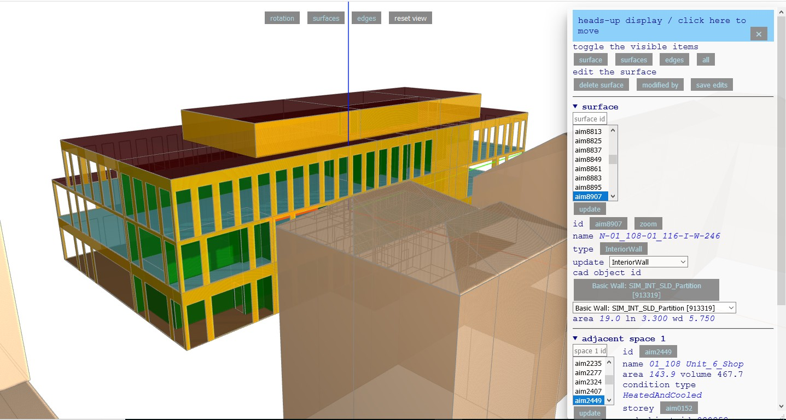

[You are now in a GitHub source code view - click this link to view Read Me file as a web page](http://www.ladybug.tools/spider/index.html#gbxml-viewer/r13/2018-05-08-gbxml-webinar/README.md "View file as a web page." ) 

# 2018-05-01 gbXML Webinar Read Me

_Link to invitation:_

## [Green Building XML Webinar - May 8, 2018 at 1 pm EDT]( http://myemail.constantcontact.com/Announcing-a-gbXML-Webinar-on-Tuesday--May-8--2018-at-1-pm-EST.html?soid=1103133034893&aid=ZlDypohgPPc )

<iframe class=iframeReadMe src=http://www.ladybug.tools/spider/gbxml-viewer/r13/2018-05-08-gbxml-webinar/gbxml-clifton-downs-fixed.xml width=100% height=400px >Iframes are not displayed on github.com</iframe>

_File to de used as demo and tutorial during the webinar_

### Full screen: [gbxml-clifton-downs-fixed.html]( http://www.ladybug.tools/spider/gbxml-viewer/r13/2018-05-08-gbxml-webinar/gbxml-clifton-downs-fixed.html )

### Full screen: [gbxml-clifton-downs-broken.html]( http://www.ladybug.tools/spider/gbxml-viewer/r13/2018-05-08-gbxml-webinar/gbxml-clifton-downs-broken.html )

### [2018-05-08 gbXML Webinar Outline]( http://www.ladybug.tools/spider/gbxml-viewer/r13/2018-05-08-gbxml-webinar/2018-05-01-gbxml-webinar-outline.html )

## Text from Invitation

We will be holding a Green Building XML (gbXML) webinar on May 8, 2018 from 1 to 2 pm EST. This webinar is targeted toward energy modelers, engineers, architects, software vendors, and generally anyone who is interested in viewing the latest in Ladybug Tool workflows with an emphasis on integration with Green Building XML. The agenda will be as follows:

1 Overview of gbXML
2 Presentation by Chris Mackey of Ladybug Tools demoing a couple of the free Ladybug design tools including Honeybee.
3 Presentation by Michal Dengusiak, assisted by the developer Theo Armour, demoing the new open-source, web-based gbXML Viewer as part of the Spider project.
4 Q&A

All of these tools and schemas are open source and free to use helping you better analyze buildings for energy performance, daylighting, thermal performance, and much more. Please join us on May 8th for this enlightening webinar.

## Links of Interest

### [gbXML.org]( http://www.gbxml.org/ )

### [gbXML on GitHub]( https://github.com/greenbuildingxml/ )

## Change Log

### 2018-05-01 ~ Thwo

* First commit

***

# 
<a href=javascript:window.scrollTo(0,0); style=text-decoration:none; > &#x1f578; </a>

