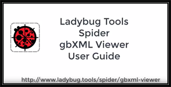

## Ladybug Tools / Spider

# Aragog gbXML Viewer R13

[Aragog gbXML Viewer]( https://github.com/ladybug-tools/spider "Source code on GitHub" ) is a collection of [free, open source]( https://opensource.guide/ "Read all about it at OpenSource Guides" ) modular [JavaScript]( https://developer.mozilla.org/en-US/docs/Web/JavaScript/About_JavaScript "Callout to Brendan" ) / [WebGL]( https://www.khronos.org/webgl/ "Tip of the hat to Ken Russell" ) / [Three.js]( https://threejs.org/ "Hi Mr.doob" ) experiments hosted on [GitHub]( https://github.com/about "Beep for where the geek peeps keep" ) for viewing, validating and editing [gbXML]( http://gbxml.org "Where's your schema today?" ) files in 3D in your browser.

Click or touch the 3D model to get started!

Questions: [Ladybug Tools forum]( http://discourse.ladybug.tools/c/spider "Hi Mostapha" ) &nbsp; Bugs: [GitHub issues]( https://github.com/ladybug-tools/spider/issues "Say hello to Michal & Theo!" )

### Please watch and thumbs-up our YouTube video:

<!--

Welcome  ~ R.

-->

Welcome 2018-05-04 ~ R13.11/12

We have a new name: "Aragog gbXML Viewer"

See
* [Aragog | Harry Potter Wiki]( http://harrypotter.wikia.com/wiki/Aragog )
* [Aragog - Pottermore]( https://www.pottermore.com/explore-the-story/aragog )
* [Scientists Name Just-Discovered Brazilian Cave Spider After Aragog from Harry Potter]( http://mentalfloss.com/article/524700/scientists-name-just-discovered-brazilian-cave-spider-after-aragog-harry-potter )

From now on, all Spider apps will contain the name of a fictional spider

* <https://en.wikipedia.org/wiki/List_of_fictional_arthropods>

HUD /Head-up Display Module
* Update Space IDs working

ISS Module / Issues Panel
* All panels now support the new standardized select + attributes panel

REP / Reports
* Openings displaying as expected

Welcome 2018-04-30 ~ R13.10

HUD /Head-up Display Module
* Update CAD Object ID now working
* Update Space IDs nearly working

Welcome 2018-04-22 ~ R13.7

New Heads-Up Display is now turned on.

A very extensive rewrite of REP/GBI/NUM/ISS/HUD in progress

HUD /Head-up Display Module
* If gbXML file has only a single space:
	* Past: displays blank HUD
	* Now: displays relevant HUD data plus following message 'Model has only a single space, therefore there is no adjacent space data to be shown here.'

REP / Reports Module
* Element attributes starting to have buttons to update the display
	* Buttons for: ID, Surface type, Adjacent spaces, CAD object ID, Space and Zone
* Add all elements automatically visible in model view on change

ISS / Issues Module
* Add metadata check
* Add surface type, opening type and adjacent space checks

CSS / Style Sheet
* Better handling of sliding menus and pop ups on small devices

Welcome 2018-04-11 ~ R13.3

HUD /Head-up Display Module
* If gbXML file has only a single space:
	* Past: displays blank HUD
	* Now: displays relevant HUD data plus following message 'Model has only a single space, therefore there is no adjacent space data to be shown here.'

REP / Reports Module
* Element attributes starting to have buttons to update the display
	* Buttons for: ID, Surface type, Adjacent spaces, CAD object ID, Space and Zone
* Add all elements automatically visible in model view on change

ISS / Issues Module
* Add metadata check
* Add surface type, opening type and adjacent space checks

CSS / Style Sheet
* Better handling of sliding menus and pop ups on small devices
* Left menu needs more work

Welcome 2018-04-03 ~ R13.2

REP / Reports Module
* Very reorganized / all functions based on set and get
	* Should be more maintainable and extendable
* Variable and function names with clearer / more self-evident structure

APP / Application Module

* Only a single Feature panel is visible at any given time
	* Multiple visible panels added complexity without much benefit

Welcome 2018-04-02 ~ R13.1 

R13.2

HUD /Head-up Display Module
* If gbXML file has only a single space:
	* Past: displays blank HUD
	* Now: displays relevant HUD data plus following message 'Model has only a single space, therefore there is no adjacent space data to be shown here.'

REP / Reports Module
* Element attributes starting to have buttons to update the display
	* Buttons for: ID, Surface type, Adjacent spaces, CAD object ID, Space and Zone
* Spaces report has zoom button

CSS / Style Sheet
* Better handling of sliding menus and pop ups on small devices
* Left
R13.1
* Starting to have revision numbers
* REP / Reports Module
	Add 'Openings by Type' panel

ISS / Issues & Num / Numbers Modules
* Various fixes

HUD / Heads-Up Display Module
* Added and appears to be functioning OK
* Add the style theming to the window
* Streamline self-loading capability

Issue: Process of toggling the visibility of meshes, edges and openings needs streamlining.
* Often things that should be made visible when clicking around are not
* You need to click the 'all' button too often

R13
* 2018-03-26:First Commit
* 2018-03-29: Multiple color themes and menu-toggles looking good
* 2018-03-31 ~ REP / Reports Module
	* New user experience
	* Display reports for all available attributes for surfaces, spaces, storeys, zones and openings
	* Add opening visibility toggle
	* Add 'Exposed to Sun' button

### R13 Objectives

* Seriously simplify GBP module << done
* Reorganized HTML element IDs and CSS style names so all items correspond to one another nicely << getting there
* Establish the Modules Explorer as the single source for access to features list, change log, support, links to GitHub source and read me, and more
* Continue adding items to Reports, Issues and Numbers << lots happenning here
* Establish three sets of CSS styles for: << Nope. Added 23 user selected UI color schemes instead
	* "Archie" the architect: all Pastels/ Looks Like Apple made it
	* "Cody" the coder: White text on black
	* "Inge" the ingénieure: All the colors imaginable

***

<h2 onclick=divMenu.scrollTop=0; style=cursor:pointer;text-align:center; title='go to top and, btw, my web is better than your web' > &#x1f578; </h2>
