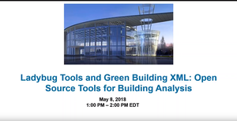

## Ladybug Tools / Spider

# Aragog gbXML Viewer R14

[Aragog gbXML Viewer]( https://github.com/ladybug-tools/spider "Source code on GitHub" ) is a collection of [free, open source]( https://opensource.guide/ "Read all about it at OpenSource Guides" ) modular [JavaScript]( https://developer.mozilla.org/en-US/docs/Web/JavaScript/About_JavaScript "Callout to Brendan" ) / [WebGL]( https://www.khronos.org/webgl/ "Tip of the hat to Ken Russell" ) / [Three.js]( https://threejs.org/ "Hi Mr.doob" ) experiments hosted on [GitHub]( https://github.com/about "Beep for where the geek peeps keep" ) for viewing, validating and editing [gbXML]( http://gbxml.org "Where's your schema today?" ) files in 3D in your browser.

Click or touch the 3D model to get started!

Questions: [Ladybug Tools forum]( http://discourse.ladybug.tools/c/spider "Hi Mostapha" ) &nbsp; Bugs: [GitHub issues]( https://github.com/ladybug-tools/spider/issues "Say hello to Michal & Theo!" )  &nbsp; Wishlist: [R14 WishList](http://www.ladybug.tools/spider/#gbxml-viewer/r14/assets/gbxml-viewer-support-issues-wish-list.md)

### Please watch and thumbs-up our YouTube video:

<!--

Welcome  ~ R.

-->

Welcome 2018-06-16 ~ R14.3 ~ Concept for this release

* Try and get all modules fitting into some kind of cohent whole
	* See if we can get this to be a big release that lasts several months
* Variable and functions clear, consistent, understandable names throughout
* Pass W3C and JSHint validation throughout
* Two window solution instead of three
* All load-time error and useful stats reporting easily accessible and visible
* Issues Panel: big cleanup / add find faulty surface inclusions
* Heads-up display: Add vertex editing capabilities

***

<h2 onclick=divMenu.scrollTop=0; style=cursor:pointer;text-align:center; title='go to top and, btw, my web is better than your web' > &#x1f578; </h2>
